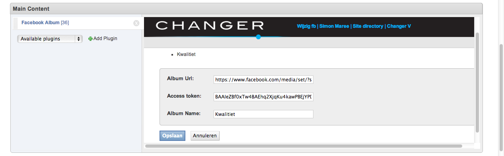
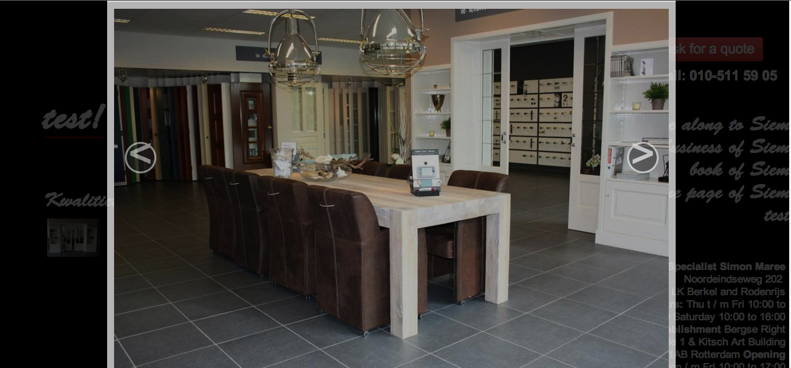

# Facebook Album Plugin - Django CMS

This is gallery plugin with support for Facebook Album. You should use it because :
- It uses facebook for storing images and saves your valuable media storage. 
- Your Client/User has a liberty to add or remove images from facebook and it gives better experience to them.
- Images recieved from facebook are cropped to lower size without considerable loss in quqlity.
- Image are presented in convenient thumbnail, which on clicking would open up in carousel or lightbox.


#Installation

Installation is dead simple. First start your virtualenv

```bash
$ workon sample
(sample)$ pip install cmsplugin-fbalbum
```
After installation, add `'cmsplugin_fbalbum'` to `settings.py`

```python
INSTALLED_APPS = (
    ...
    'cmsplugin_fbalbum',
    ...
)
```

You might need to do this if you are getting some sort of database error.

```bash
$ python manage.py syncdb
$ python manage.py migrate
```
In case you face any problems, file issues and if you want to contribute take a look at 
the existing issues and send a pull request.

##How to get the access token required ?

First you have to  create an APP on facebook.Then,go get your temporary/short-lived **access_token** [temporary access_token](https://developers.facebook.com/tools/access_token/) 
Save that **access_token** and now and then you need to go to this URL to get the permanent access_token:

First make sure you have:

- app_id
- app_secret
- access_token(retrieved from first step)

Replace this values in the url below and get the access token valid for 3 months.

`http://graph.facebook.com/oauth/access_token?grant_type=fb_exchange_token&client_id={app-id}&
client_secret={app-secret}&fb_exchange_token={short-lived-token} `

**Since we are not following a server side approach here, make sure you generate
new access tokens and replace them every three months.**


###Preview

- Entering the details in plugin form:



- Thumbnail view of plugin:

![Small View] (img/smallview.png)

- Image slideshow in carousel


